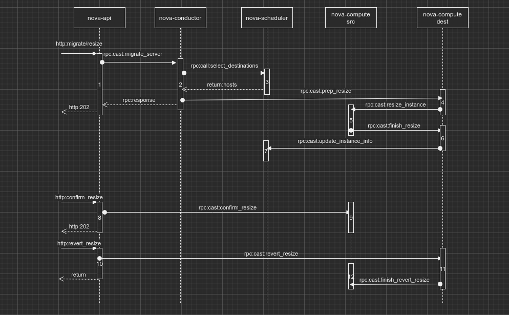

### [API](https://docs.openstack.org/api-ref/compute/?expanded=migrate-server-migrate-action-detail#migrate-server-migrate-action)

> POST /servers/{server_id}/action

Migrate Server (migrate Action)

Specify the migrate action in the request body.

Up to microversion 2.55, the scheduler chooses the host. Starting from microversion 2.56, the host parameter is available to specify the destination host. If you specify null or don’t specify this parameter, the scheduler chooses a host.

Asynchronous Postconditions

A successfully migrated server shows a VERIFY_RESIZE status and finished migration status. If the cloud has configured the resize_confirm_window option of the Compute service to a positive value, the Compute service automatically confirms the migrate operation after the configured interval.

Policy defaults enable only users with the administrative role to perform this operation. Cloud providers can change these permissions through the policy.json file.

Normal response codes: 202

Error response codes: badRequest(400), unauthorized(401), forbidden(403) itemNotFound(404), conflict(409)

**Example Migrate Server (migrate Action) (v2.1)**

```
{
    "migrate": null
}
```

**Example Migrate Server (migrate Action) (v2.56)**
```
{
    "migrate": {
        "host": "host1"
    }
}
```

### Overview



### Workflow

**1 nova-api(nova.compute.api.API.resize)**

* check vm_state in [stopped, active]
* flavor check
  * migrate->flavor_id is None
  * resize  ->new flavor_id
* quota  reserve if resize
* save instance task_state to **"resize_prep"**
* allow_resize_to_same_host
* rpc cast to conductor migrate_server **goto 2**

**2  nova-conductor**
* set request_spec
* rpc call select_destinations -> 3
* rpc cast prep_resize to destionation host -> 4

**3 nova-scheduler**
* select destinations by request_specs

**4 nova-compute destination(nova.compute.manager.ComputeManager.prep_resize)**
* notify about instance usage "compute.instance.resize.prep.start"
* check support migrate to same host
* record "old_vm_state" to system metadata for set the resized/reverted instance back to the same state
* resize claim
* rpc cast resize instance to source nova-compute -> 5

**5 nova-compute source(nova.compute.manager.ComputeManager.resize_instance)**
* get network info
* save migrate status to "migrating"
* save instance task_state to "resize_migrating"
* notify about instance usage "compute.instance.resize.start"
* driver migrate disk and power off
  * check boot from volume
  * check share storage
  * power off
  * get block device mapping
  * disconnect volumes
  * rename instance base dir to name with "_resize" suffix
  * copy image to destinantion host
* call cinder api to terminate volume connections
* save migration status to "post-migrating"
* save instance host and node to destination host
* save instance task_state to "resize_migrated"
* rpc cast  finsh resize to destination compute -> 6
* notify about instance usage "compute.instance.resize.end"

**6 nova-compute destination(nova.compute.manager.ComputeManager.finish_resize)**
* call neutron api to setup network on host
* call neutron  api migrate instance finish
* call neutron api get instance network information
* save instance task_state to "resize_finish"
* notify about instance usage "compute.instnace.finsh_resize.start"
* get block device information
  * call cinder api to initialize connection
* driver finish migration
  * create image if backing file missed, create disk snapshot
  * ensure console log for instnace
  * create config drive
  * resize disk if resize instance
  * get guest xml
     * connect volumes
  * create domain and network
  * power on if old vm state was power on
* save migration status to "finished"
* save instance vm_state to "resized"  and task_state to None
* update scheduler instance info -> 7
* notify about instance usage "compute.instnace.finish_resize.end"
* commit quota if resize

**7 nova-scheduler**
* update host manager instance list

**8 nova-api(nova.compute.api.API.confirm_resize)**
* check vm_state in [resized]
* save migration status "confirming"
* rpc cast confirm resize to source compute -> 9

**9 nova-compute source(nova.compute.manager.ComputeManager.confirm_resize)**
* check migration status
* notify about instance usage "compute.instance.resize.confirm.start"
* setup network  on host, tear down
* call neutron api to get network information
* driver confirm migration
  * remove dir of "_resize"
  * remove root disk snapshot
  * undefine libvirt domain
  * unplug vifs
  * unfilter instance
* save migration status "confirmed"
* resource tracer drop move claim
* save instance task_state to None and vm state to "active" or "shutdown" according to its power state
* notify about instace usage "compute.instance.resize.confirm.end"
* commit quota

**10 nova-api(nova.compute.api.API.revert_resize)**
* check vm_state in [resized]
* save instance task_state to "resize_reverting"
* save migration status to "reverting"
* rpc cast revert resize to destination compute -> 11

**11 nova-compute destination(nova.compute.manager.ComputeManager.revert_resize)**
* setup network on host, tear down
* call network api migrate instance start
* call network api get instance network info
* get block device info
* check share storage
* driver destroy
  11.6.1
* call volume api to terminate volume connections
* save migration status to "reverted"
* resource tracker drop move claim
* rpc cast finish revert resize to source compute -> 12

**12 nova-compute source(nova.compute.manager.ComputeManager.finish_revert_resize)**
* notify about instance usage "compute.instnace.revert.resize.start"
* set instance flavor to old flavor if resize
* save instance host and node to source compute node
* call network api setup network on host
* call network api get instance network info
* driver finish revert migration
  * clean up failed migration
  * remove dir of "*_resize"
  * roll back to snapshot
  * remove snapshot
  * get guest xml
  * create domain and network
  * wait if power on
* save instance vm_state according to its power state, shutdown if power was off, active if power on,  task_state to None
* notify about instance usage "compute.instance.revert.resize.end"
* quota commit
